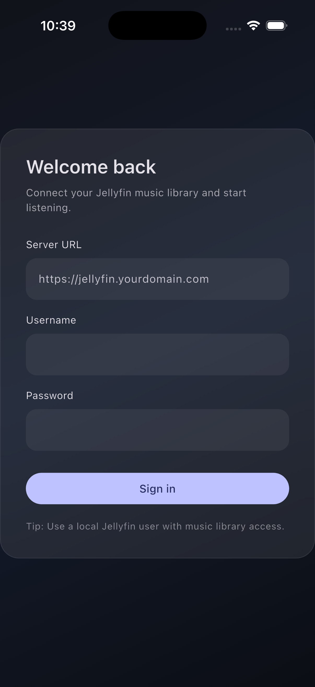
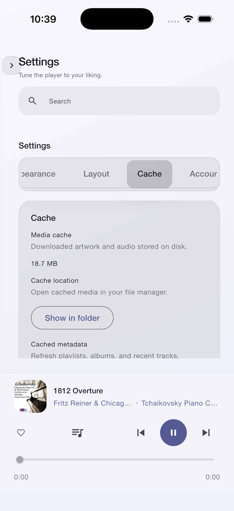
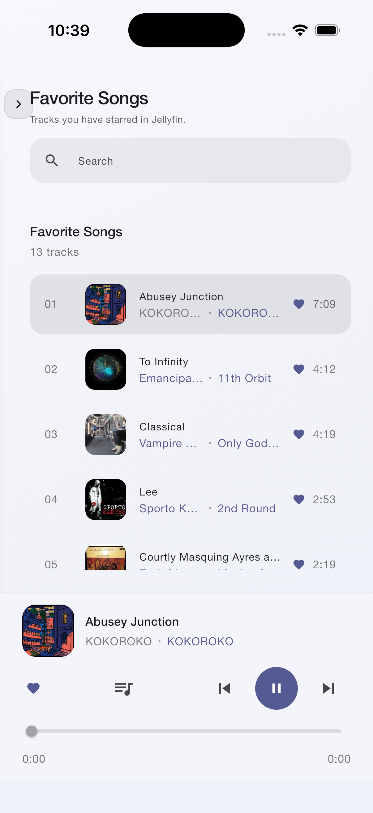
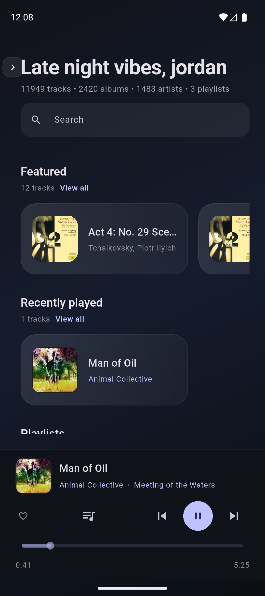
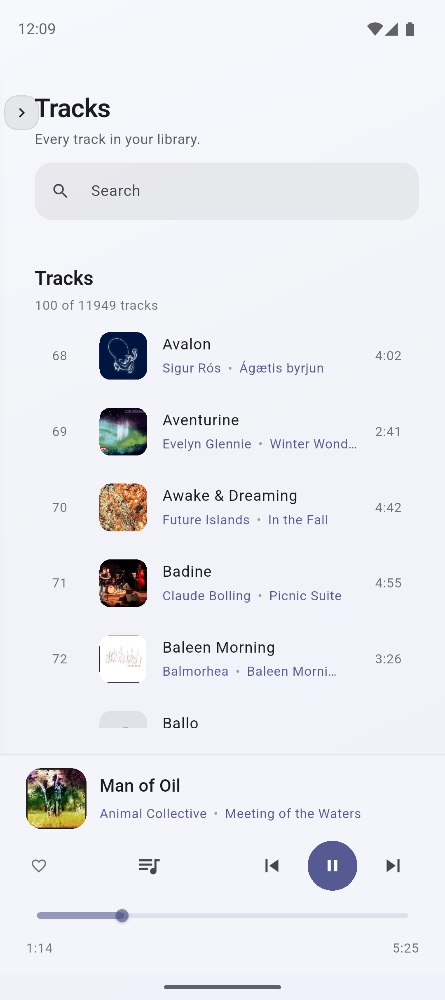

<h1 align=center>Coppelia</h1>
<p align="center">
  A native macOS, iOS, Android, and Linux app for Jellyfin music libraries (Windows coming soon).
</p>
<p align="center">
   &nbsp;
   &nbsp;
   &nbsp;
   &nbsp;
  <br />
   &nbsp;
  &nbsp;
</p>

---

Coppelia is a cross-platform app designed for Jellyfin music libraries. I built it because I couldn't find an app that was:

-   native / low-resource
-   beautiful
-   open source

If you hold in your heart other bulletpoints than these, please share and help make Coppelia better!

## Screenshots

For more screenshots and info about themes, see [the wiki](https://github.com/j6k4m8/coppelia/wiki/Themes).

### macOS


### Mobile (iOS + Android)

|                             |                            |                                                                                      |                                                                                      |
| --------------------------- | -------------------------- | ------------------------------------------------------------------------------------ | ------------------------------------------------------------------------------------ |
|    |  |  |  |
|  |  |                                                          |  |

## Features

-   Jellyfin authentication
-   Fast library browsing and search (albums, artists, genres, playlists)
-   Playlist management with create, rename, delete, add/remove tracks, and drag reordering
-   Audio playback with queue controls, play-next, and clear-queue
    -   macOS Now Playing integration + media key shortcuts
-   Gapless playback between tracks
-   Repeat playback (track or queue)
-   Android lockscreen + notification media controls with artwork
-   Linux desktop support (GTK)
-   Favorite and unfavorite tracks/albums/artists
-   Playback resume that restores your last track and position when you reopen the app
-   Configurable home shelves, sidebar sections, and layout choices
-   Appearance controls: theme mode, font family, font scale, and layout density
-   Accent color presets, custom hex, and now playing palette theming
-   A–Z track browsing with quick alphabet jump
-   Shuffle playback for albums, artists, genres, and playlists
-   Jump in random picks with auto-refresh
-   Full-screen Now Playing view with immersive artwork
-   Mobile gestures: Now Playing swipes + edge-swipe sidebar
-   Cached playlists/tracks/audio with size reporting and cache management
-   Pin tracks, albums, and artists for offline playback via context menus
-   Download manager with per-item progress, prioritization, and Wi-Fi rules
-   Offline library sections for pinned albums, artists, playlists, and tracks
-   Offline mode toggle that switches the UI to cached-only content
-   Album/artist header actions for favorites and offline pinning
-   Optional auto-download of favorited items for offline playback (Wi-Fi only toggle)
-   Artwork fallbacks and rich detail views with context actions
-   Smart Lists (self-updating local playlists)
-   **NO ELECTRON 🫦**

## Downloads & Installation

For macOS, iOS, and Android, you can download Coppelia from [the Releases page](https://github.com/j6k4m8/coppelia/releases).

### macOS

You will need to allow Coppelia to run from _System Preferences > Security & Privacy > General_, as it is not yet notarized by Apple. Alternatively from the terminal, you can run:

```bash
xattr -d com.apple.quarantine /path/to/Coppelia.app
```

### Android

You may need to enable installation from unknown sources in your device settings.

F-Droid listing coming soon!

### iOS

You will need to sideload the app using Xcode or a tool like AltStore for now...

### Linux

I am not sure! I don't have a linux machine handy. If you do, and you can get stuff to run, please let me know!

## Keyboard Shortcuts

All shortcuts are configurable in the Settings screen. `^` indicates the Cmd key on macOS, and the Ctrl key on Windows/Linux.

| Action               | Keyboard Shortcut             |
| -------------------- | ----------------------------- |
| Play / Pause         | Media Play/Pause Key/Spacebar |
| Next Track           | Media Next Track Key          |
| Previous Track       | Media Previous Track Key      |
| Focus Search Field   | `^` + `K`                     |
| Clear Search Field   | `Esc`                         |
| Open Settings Screen | `^` + `,`                     |

## Roadmap

-   Windows support (**can you help test**??)
-   AirPlay and Chromecast support
-   Your idea here?

## Smart Lists

Smart Lists are self-updating, local playlists powered by rules.
See [`docs/Smart-Lists.md`](docs/Smart-Lists.md) for the full guide and query language.


---

## Developing

-   macOS: `docs/Developing-macOS.md`
-   iOS (Simulator): `docs/Developing-iOS.md`
-   Android (Emulator/Device): `docs/Developing-Android.md`
-   Linux: `docs/Developing-Linux.md`

## Notes

-   The Jellyfin server URL should be your base URL (for example `https://jellyfin.example.com`).
-   Cached audio is stored using Flutter's cache manager to speed up repeat playback.
