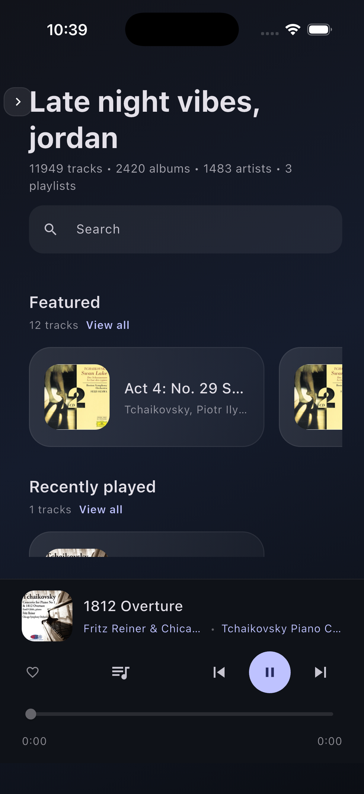

<h1 align=center>Coppelia</h1>

  A native macOS, iOS, and Android app for Jellyfin music libraries (Windows/Linux coming soon).

   &nbsp;
   &nbsp;
   &nbsp;
  

Coppelia is a cross-platform app designed for Jellyfin music libraries. I built it because I couldn't find an app that was:

-   native / low-resource
-   beautiful
-   open source

If you hold in your heart other bulletpoints than these, please share and help make Coppelia better!

## Screenshots

### macOS

|    |     |
| ----------------------------------- | ----------------------------------- |
|  |  |

### Mobile (iOS + Android)

|                             |                            |                              |
| --------------------------- | -------------------------- | ---------------------------- |
|    |  |     |
|  |  |  |

## Features

-   Jellyfin authentication
-   Fast library browsing and search (albums, artists, genres, playlists)
-   Audio playback with queue controls, play-next, and clear-queue
    -   macOS Now Playing integration + media key shortcuts
-   Favorite and unfavorite tracks/albums/artists
-   Playback resume that restores your last track and position when you reopen the app
-   Configurable home shelves, sidebar sections, and layout choices
-   Appearance controls: theme mode, font family, font scale, and layout density
-   A–Z track browsing with quick alphabet jump
-   Shuffle playback for albums, artists, genres, and playlists
-   Jump in random picks with auto-refresh
-   Full-screen Now Playing view with immersive artwork
-   Cached playlists/tracks/audio with size reporting and cache management
-   Artwork fallbacks and rich detail views with context actions
-   **NO ELECTRON 🫦**

## Keyboard Shortcuts

All shortcuts are configurable in the Settings screen. `^` indicates the Cmd key on macOS, and the Ctrl key on Windows/Linux.

| Action               | Keyboard Shortcut        |
| -------------------- | ------------------------ |
| Play / Pause         | Media Play/Pause Key     |
| Next Track           | Media Next Track Key     |
| Previous Track       | Media Previous Track Key |
| Focus Search Field   | `^` + `K`                |
| Clear Search Field   | `Esc`                    |
| Open Settings Screen | `^` + `,`                |

## Roadmap

-   Windows and Linux support (can you help??)
-   Offline mode
-   Playlist creation and editing
-   More playback features (shuffle, repeat, etc)
-   Your idea here?

---

## Developing

-   macOS: `docs/Developing-macOS.md`
-   iOS (Simulator): `docs/Developing-iOS.md`
-   Android (Emulator/Device): `docs/Developing-Android.md`

## Notes

-   The Jellyfin server URL should be your base URL (for example `https://jellyfin.example.com`).
-   Cached audio is stored using Flutter's cache manager to speed up repeat playback.
